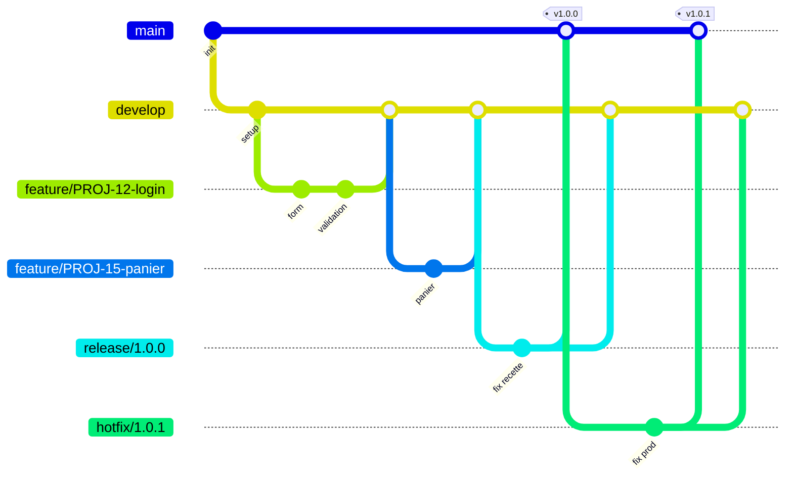

# 3. Notre workflow d'équipe : Gitflow

[⬅ Retour au sommaire](README.md)

---

## 3.1 Pourquoi Gitflow ?

Nous avons comparé plusieurs workflows avant de choisir :

| Workflow | Principe | Avantages | Inconvénients |
|----------|----------|-----------|---------------|
| **Centralisé** | Tout le monde commit sur `main` | Très simple | Conflits fréquents, `main` souvent cassée |
| **GitHub Flow** | `main` + branches de feature courtes | Simple, idéal en déploiement continu | Pas de gestion des versions / de la recette |
| **Trunk-Based** | Intégration très fréquente dans le tronc | Rapide | Exige beaucoup de tests automatisés et de *feature flags* |
| **Gitflow** ✅ | Branches dédiées : `main`, `develop`, `feature`, `release`, `hotfix` | Versions maîtrisées, production toujours stable, travail en parallèle | Plus de branches à gérer |

**Notre choix : Gitflow**, car :

- nous livrons des **versions numérotées** (v1.0.0, v1.1.0…) après une phase de recette ;
- plusieurs développeurs travaillent **en parallèle** sur des fonctionnalités différentes ;
- la branche `main` doit **toujours** refléter ce qui est en production ;
- nous devons pouvoir **corriger un bug en production** sans livrer les fonctionnalités en cours.

## 3.2 Les branches

### Branches permanentes

| Branche | Rôle | Qui y écrit ? |
|---------|------|---------------|
| `main` | Code **en production**. Chaque commit = une version taguée. | Uniquement via merge de `release/*` ou `hotfix/*` |
| `develop` | Branche d'**intégration** : contient les fonctionnalités terminées pour la prochaine version. | Uniquement via Pull Request |

> 🔒 `main` et `develop` sont **protégées** sur le serveur : push direct interdit, PR + 1 approbation + CI verte obligatoires.

### Branches temporaires

| Type | Créée depuis | Fusionnée dans | Nommage | Durée de vie |
|------|--------------|----------------|---------|--------------|
| **feature** | `develop` | `develop` | `feature/<ticket>-<description>` | Quelques jours |
| **release** | `develop` | `main` **et** `develop` | `release/<version>` | Le temps de la recette |
| **hotfix** | `main` | `main` **et** `develop` | `hotfix/<version>` | Quelques heures |
| **bugfix** *(optionnel)* | `develop` ou `release/*` | Branche d'origine | `bugfix/<ticket>-<description>` | Court |

---

## 3.3 Vue d'ensemble

> 💡 Ce diagramme s'affiche automatiquement sur GitHub, GitLab et dans VS Code (avec une extension Mermaid).

---
