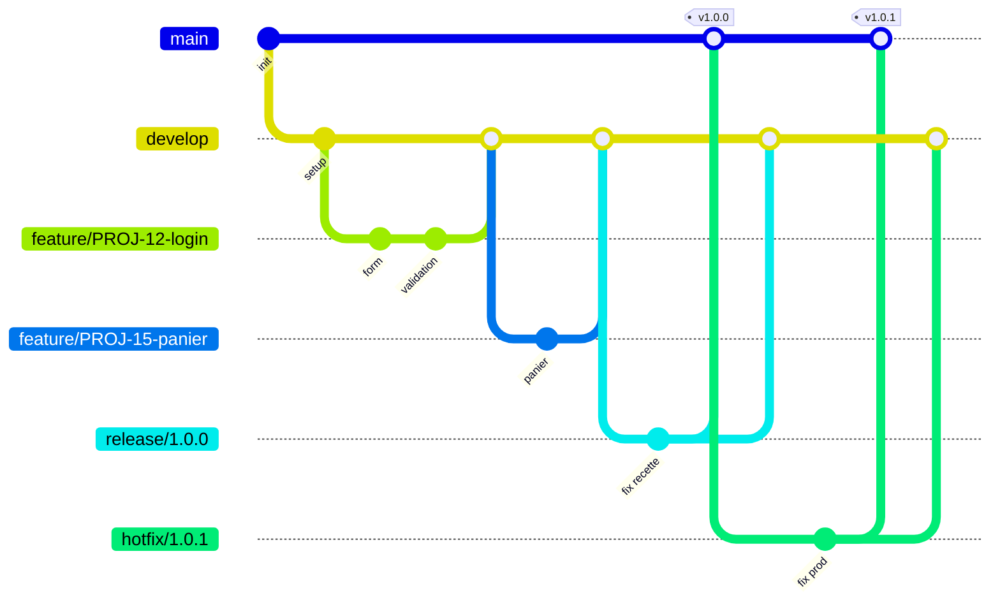

# 3. Notre workflow d'équipe : Gitflow

[⬅ Retour au sommaire](README.md)

---

## 3.1 Pourquoi Gitflow ?

Nous avons comparé plusieurs workflows avant de choisir :

| Workflow | Principe | Avantages | Inconvénients |
|----------|----------|-----------|---------------|
| **Centralisé** | Tout le monde commit sur `main` | Très simple | Conflits fréquents, `main` souvent cassée |
| **GitHub Flow** | `main` + branches de feature courtes | Simple, idéal en déploiement continu | Pas de gestion des versions / de la recette |
| **Trunk-Based** | Intégration très fréquente dans le tronc | Rapide | Exige beaucoup de tests automatisés et de *feature flags* |
| **Gitflow** ✅ | Branches dédiées : `main`, `develop`, `feature`, `release`, `hotfix` | Versions maîtrisées, production toujours stable, travail en parallèle | Plus de branches à gérer |

**Notre choix : Gitflow**, car :

- nous livrons des **versions numérotées** (v1.0.0, v1.1.0…) après une phase de recette ;
- plusieurs développeurs travaillent **en parallèle** sur des fonctionnalités différentes ;
- la branche `main` doit **toujours** refléter ce qui est en production ;
- nous devons pouvoir **corriger un bug en production** sans livrer les fonctionnalités en cours.

## 3.2 Les branches

### Branches permanentes

| Branche | Rôle | Qui y écrit ? |
|---------|------|---------------|
| `main` | Code **en production**. Chaque commit = une version taguée. | Uniquement via merge de `release/*` ou `hotfix/*` |
| `develop` | Branche d'**intégration** : contient les fonctionnalités terminées pour la prochaine version. | Uniquement via Pull Request |

> 🔒 `main` et `develop` sont **protégées** sur le serveur : push direct interdit, PR + 1 approbation + CI verte obligatoires.

### Branches temporaires

| Type | Créée depuis | Fusionnée dans | Nommage | Durée de vie |
|------|--------------|----------------|---------|--------------|
| **feature** | `develop` | `develop` | `feature/<ticket>-<description>` | Quelques jours |
| **release** | `develop` | `main` **et** `develop` | `release/<version>` | Le temps de la recette |
| **hotfix** | `main` | `main` **et** `develop` | `hotfix/<version>` | Quelques heures |
| **bugfix** *(optionnel)* | `develop` ou `release/*` | Branche d'origine | `bugfix/<ticket>-<description>` | Court |

---

## 3.3 Vue d'ensemble



> 💡 Ce diagramme s'affiche automatiquement sur GitHub, GitLab et dans VS Code (avec une extension Mermaid).

---
## 3.4 Cycle de vie détaillé

### 🟢 Feature : développer une fonctionnalité

```text
develop ──●────────────────────●──▶
           \                  /  (Pull Request + revue)
feature     ●────●────●──────●
```

1. Partir d'un `develop` à jour.
2. Créer `feature/PROJ-42-description`.
3. Commiter régulièrement, pousser la branche.
4. Rester à jour avec `develop` (`git rebase origin/develop`).
5. Ouvrir une **Pull Request vers `develop`**.
6. Revue de code + CI verte → **merge** (par l'auteur après approbation).
7. Supprimer la branche.

👉 [Tutoriel pas à pas](04-tutoriels.md#tuto-2--développer-une-fonctionnalité-feature)

### 🟡 Release : préparer une mise en production

```text
develop ──●─────────────●────▶
           \           / (back-merge)
release     ●───●───●─●
                       \
main    ────────────────●──▶  tag v1.2.0
```

1. Quand `develop` contient tout ce qui est prévu pour la version, le **responsable de release** crée `release/1.2.0`.
2. **Gel des fonctionnalités** : sur cette branche, seulement des corrections de bugs, la mise à jour du numéro de version et du `CHANGELOG.md`.
3. Recette / tests sur l'environnement de pré-production.
4. Merge dans `main` → **tag `v1.2.0`** → déploiement en production.
5. Merge dans `develop` pour récupérer les corrections.
6. Suppression de la branche `release/1.2.0`.

👉 [Tutoriel pas à pas](04-tutoriels.md#tuto-3--préparer-une-release)

### 🔴 Hotfix : corriger un bug urgent en production

```text
main    ──●(v1.2.0)─────────●──▶ tag v1.2.1
           \               /
hotfix      ●────●────────●
                           \
develop ────────────────────●──▶
```

1. Créer `hotfix/1.2.1` **depuis `main`** (pas depuis `develop` !).
2. Corriger, tester, incrémenter le numéro de version (patch).
3. PR vers `main` → merge → **tag `v1.2.1`** → déploiement.
4. Merge aussi dans `develop` (sinon le bug reviendra à la prochaine release !).
   - ⚠️ Si une branche `release/*` est en cours, fusionner le hotfix **dans la release** plutôt que dans `develop`.

👉 [Tutoriel pas à pas](04-tutoriels.md#tuto-4--corriger-un-bug-en-production-hotfix)

---

## 3.5 Numérotation des versions (SemVer)

Nous suivons le **Semantic Versioning** : `MAJEUR.MINEUR.CORRECTIF` (ex. `2.4.1`).

| Incrément | Quand ? | Exemple |
|-----------|---------|---------|
| **MAJEUR** | Changement incompatible (API cassée, migration lourde) | `1.4.2` → `2.0.0` |
| **MINEUR** | Nouvelle fonctionnalité rétro-compatible (→ `release`) | `1.4.2` → `1.5.0` |
| **CORRECTIF** | Correction de bug (→ `hotfix`) | `1.4.2` → `1.4.3` |

Les tags sont préfixés par `v` : `v1.5.0`.

---

## 3.6 Rôles et responsabilités

| Rôle | Responsabilités |
|------|-----------------|
| **Développeur** | Crée ses branches `feature/*`, ouvre les PR, relit les PR des collègues |
| **Relecteur (reviewer)** | Relit le code sous 24 h ouvrées, approuve ou demande des modifications |
| **Tech Lead** | Garant du respect du workflow, arbitre en cas de conflit technique, administre les protections de branches |
| **Responsable de release** | Crée et clôture les branches `release/*`, gère le `CHANGELOG.md` et les tags |

---

## 3.7 Stratégie de merge

| PR | Méthode de merge | Pourquoi |
|----|------------------|----------|
| `feature/*` → `develop` | **Squash and merge** *(ou merge commit si l'historique de la branche est propre)* | Un commit clair par fonctionnalité dans `develop` |
| `release/*` → `main` | **Merge commit** (`--no-ff`) | Garde la trace de la release |
| `hotfix/*` → `main` | **Merge commit** (`--no-ff`) | Garde la trace du correctif |
| `release/*` ou `hotfix/*` → `develop` | **Merge commit** (`--no-ff`) | Resynchronise `develop` |

> ⚠️ Ne jamais utiliser *Squash* ou *Rebase* pour les merges vers `main` : cela casserait la synchronisation `main` ↔ `develop`.

---

## 3.8 Configuration du dépôt (pour les administrateurs)

Sur GitHub (*Settings → Branches → Branch protection rules*) ou GitLab (*Settings → Repository → Protected branches*) :

- [x] Protéger `main` et `develop`
- [x] Interdire le push direct et le `force push`
- [x] Exiger une Pull Request avec **au moins 1 approbation**
- [x] Exiger que la **CI** (tests, lint) soit verte
- [x] Exiger que la branche soit à jour avant le merge
- [x] Supprimer automatiquement la branche après merge
- [x] Définir `develop` comme branche par défaut (les PR ciblent `develop` automatiquement)

---

[⬅ Précédent : Commandes](02-commandes-essentielles.md) · [➡ Suite : Tutoriels](04-tutoriels.md)
